# MiniGrid Navigation NanoVLM (SFT + GRPO)


## Описание проекта

В проекте адаптируется vision-language модель NanoVLM для управления агентом в среде MiniGrid EmptyEnv. Агент получает частичное RGB-наблюдение 7x7 клеток и должен выбрать одно из трёх действий: `left`, `right` или `forward`.

Обучение проводится в два этапа:

1. **SFT (Supervised Fine-Tuning)** на экспертных траекториях, построенных BFS-планировщиком.
2. **GRPO-style RL fine-tuning** для дообучения политики через взаимодействие со средой.

Основные среды:

- `MiniGrid-Empty-8x8-v0` - базовая среда, где текущий pipeline работает хорошо.
- `MiniGrid-Empty-16x16-v0` - более сложная среда с длинными траекториями и большим числом состояний.

Дополнительно проверяются два свойства политики:

- перенос между размерами карты (`8x8 -> 16x16` и `16x16 -> 8x8`);
- устойчивость к изменению цвета цели с зелёного на красный.

## Оглавление

1. [Данные и эксперт](#данные-и-эксперт)
2. [Модель и обучение](#модель-и-обучение)
3. [Результаты](#результаты)
4. [Дополнительные эксперименты](#дополнительные-эксперименты)
5. [Запуск проекта](#запуск-проекта)
6. [Структура проекта](#структура-проекта)
7. [Выводы и дальнейшая работа](#выводы-и-дальнейшая-работа)

## Данные и эксперт

Экспертные траектории генерируются с помощью BFS (Breadth-First Search). Состояние в BFS включает не только позицию агента, но и направление взгляда: `(agent_x, agent_y, agent_dir)`. Действия `left` и `right` меняют ориентацию агента, позицию меняет только `forward`. 

Для уменьшения искусственного дисбаланса поворотов генератор сравнивает left-first и right-first shortest paths и выбирает путь, который уменьшает накопленный дисбаланс между `left` и `right`.

Каждый пример датасета содержит:

- `ego_image` - частичное RGB-наблюдение агента;
- `global_image` - полный вид среды;
- текстовый промпт;
- экспертное действие;
- `episode_id`, `step`, `env_size`, позицию и направление агента.

Датасеты:

| Environment | Path | Episodes | Rows | Action distribution |
|---|---|---:|---:|---|
| 8x8 | `datasets/dataset_8x8` | 1000 | 5280 | `forward=3914`, `left=686`, `right=680` |
| 16x16 | `datasets/dataset_16x16` | 1000 | 10530 | `forward=9105`, `left=726`, `right=699` |

## Модель и обучение

В проекте используется NanoVLM v0.1:

https://github.com/huggingface/nanoVLM/releases/tag/v0.1

Формат входа:

```text
User: <image>
{prompt}
Assistant:
```

Текст промпта:

```text
You are a robot in a 2D grid world. You see a 7x7 partial RGB view in front of you.
Your mission: get to the green goal square as quickly as possible.
Choose the next action: forward, left or right.
```

Целевой ответ:

```text
 left
 right
 forward
```

В SFT prompt tokens маскируются, поэтому loss считается по assistant action, а не по воспроизведению всего промпта. Train/validation split выполняется на уровне эпизодов, чтобы шаги одного эпизода не попадали одновременно в train и validation.

Validation accuracy используется только как вспомогательная offline-метрика. Основная оценка проводится в среде через `success rate`, `average reward`, `timeouts` и среднюю длину успешной траектории.

После SFT модель дообучается через GRPO-style RL loop. Политика инициализируется из SFT adapter, затем запускаются группы rollout-ов в MiniGrid. Для каждой группы считается group-relative advantage, после чего выполняется clipped update с KL-штрафом к reference SFT policy.

## Результаты

### Среда 8x8

На `MiniGrid-Empty-8x8-v0` SFT уже даёт высокое качество, а GRPO дополнительно уменьшает число timeout-ов.

Полный вид среды и частичное наблюдение агента:

| Full view | Agent view |
|---|---|
| 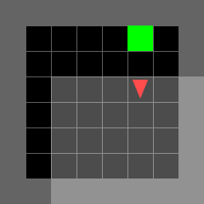 | 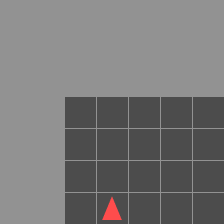 |

Команды обучения:

```powershell
python scripts/dataset_generation.py --env-size 8 --save-path datasets/dataset_8x8
python scripts/sft.py --env-size 8 --dataset-path datasets/dataset_8x8 --output-dir checkpoints/sft_adapter_8x8 --epochs 3
python scripts/grpo.py --env-size 8 --dataset-path datasets/dataset_8x8 --sft-adapter-path checkpoints/sft_adapter_8x8 --output-dir checkpoints/grpo_adapter_8x8
```

Графики обучения:

| SFT train loss | SFT validation accuracy |
|---|---|
| 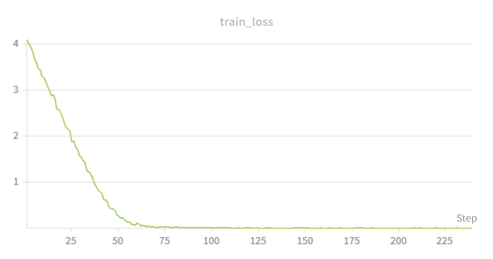 | 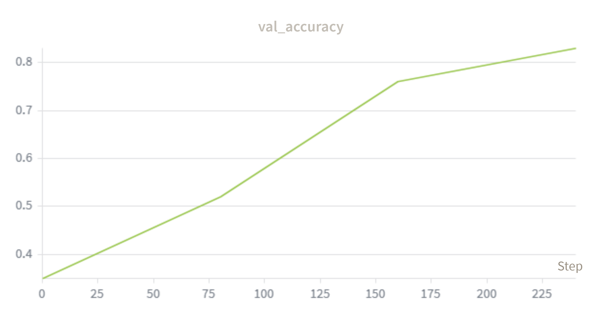 |

| GRPO loss | GRPO success rate |
|---|---|
| 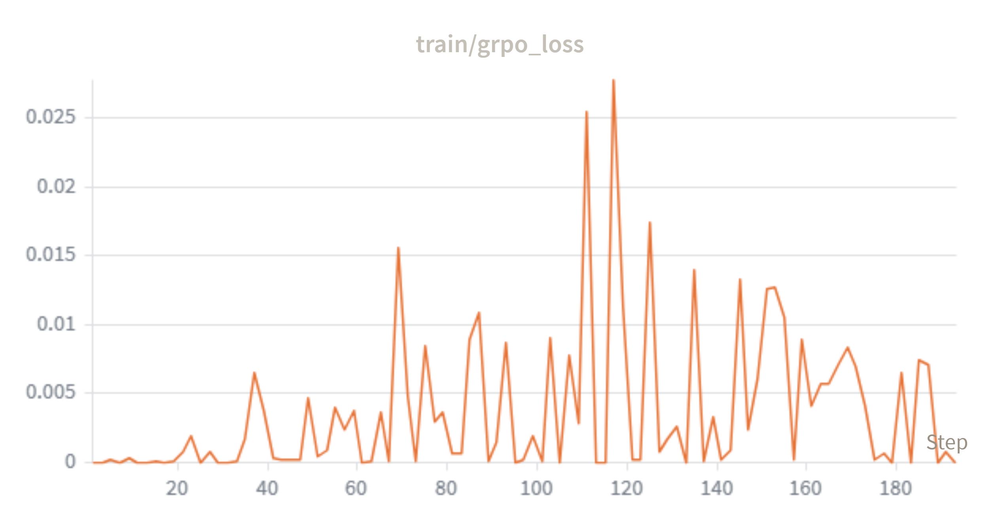 | 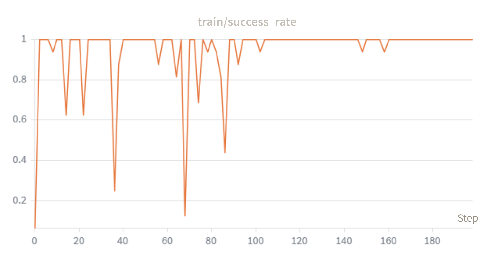 |

SFT 8x8 обучается стабильно: train loss быстро падает почти до нуля, а validation accuracy растёт с `0.35` до `0.83`. GRPO 8x8 имеет высокий success rate почти на всём протяжении обучения; отдельные провалы связаны с тем, что метрика считается на небольших группах rollout-ов и чувствительна к конкретным seed-ам.

Команда тестирования:

```powershell
python scripts/test_models.py --env-size 8 --dataset-path datasets/dataset_8x8 --sft-adapter-path checkpoints/sft_adapter_8x8 --grpo-adapter-path checkpoints/grpo_adapter_8x8 --episodes 250
```

Статистика split-а:

- train rows: `4735`, validation rows: `545`;
- majority action: `forward`;
- majority validation accuracy: `0.7413`;
- train action distribution: `left=615`, `right=610`, `forward=3510`;
- validation action distribution: `left=71`, `right=70`, `forward=404`.

Результаты тестирования:

| Policy | Success Rate | Avg Reward | Avg Steps (Win) | Timeouts | Action distribution |
|---|---:|---:|---:|---:|---|
| Majority-forward | 5.2% | 0.052 | 2.2 | 237/250 | L:0.0% / R:0.0% / F:100.0% |
| SFT | 91.2% | 0.892 | 6.1 | 22/250 | L:17.0% / R:15.5% / F:67.5% |
| GRPO | 95.2% | 0.932 | 6.1 | 12/250 | L:17.3% / R:14.9% / F:67.8% |
| Expert BFS | 100.0% | 0.982 | 5.2 | 0/250 | L:13.4% / R:13.4% / F:73.2% |

Вывод: для 8x8 pipeline `expert trajectories -> SFT -> GRPO -> environment evaluation` работает корректно. GRPO повышает success rate на `+4.0` процентных пункта относительно SFT и уменьшает число timeout-ов с `22/250` до `12/250`.

### Среда 16x16

`MiniGrid-Empty-16x16-v0` сложнее из-за более длинных траекторий. Ошибки действий накапливаются сильнее, поэтому высокая offline accuracy хуже отражает реальное качество политики.

Полный вид среды и частичное наблюдение агента:

| Full view | Agent view |
|---|---|
| 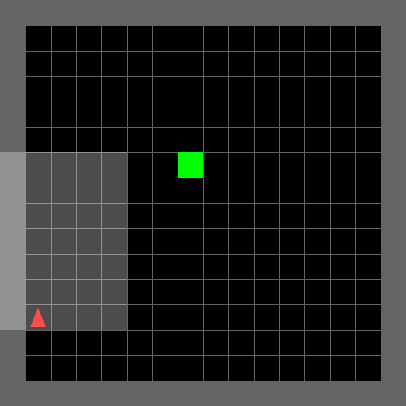 | 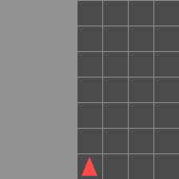 |

Команды обучения:

```powershell
python scripts/dataset_generation.py --env-size 16 --save-path datasets/dataset_16x16
python scripts/sft.py --env-size 16 --dataset-path datasets/dataset_16x16 --output-dir checkpoints/sft_adapter_16x16 --epochs 1 --val-split 0.01
python scripts/grpo.py --env-size 16 --dataset-path datasets/dataset_16x16 --sft-adapter-path checkpoints/sft_adapter_16x16 --output-dir checkpoints/grpo_adapter_16x16 --max-steps 35 --val-split 0.01
```

Графики обучения:

| SFT train loss | SFT validation accuracy |
|---|---|
| 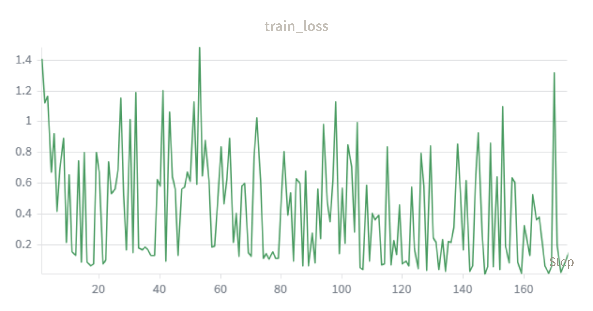 | 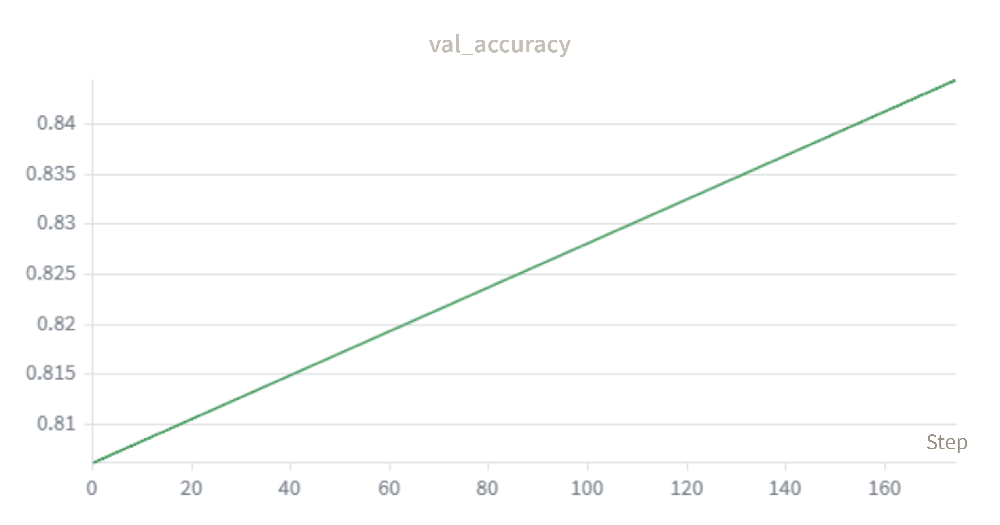 |

| GRPO loss | GRPO success rate |
|---|---|
| 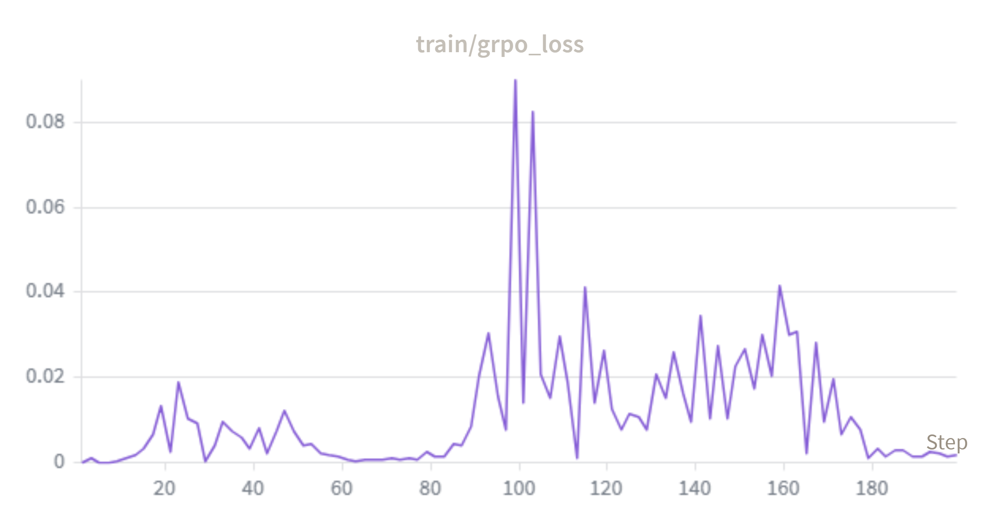 | 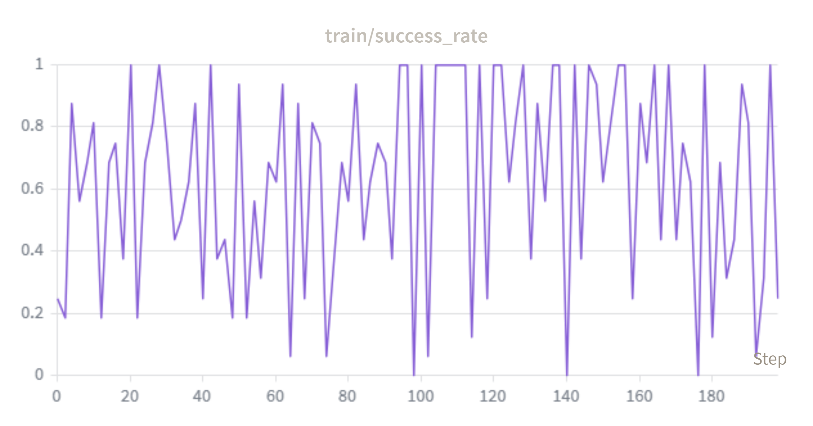 |

Для SFT 16x16 validation accuracy растёт с `0.47` до `0.87`, но train loss заметно шумит. GRPO 16x16 также нестабилен: success rate сильно колеблется, а loss имеет резкие пики. Это ожидаемо для более длинной среды с более разреженным reward.

Команда тестирования:

```powershell
python scripts/test_models.py --env-size 16 --dataset-path datasets/dataset_16x16 --sft-adapter-path checkpoints/sft_adapter_16x16 --grpo-adapter-path checkpoints/grpo_adapter_16x16 --episodes 250 --max-steps 40 --val-split 0.01
```

Статистика split-а:

- train rows: `10427`, validation rows: `103`;
- majority action: `forward`;
- majority validation accuracy: `0.8641`;
- train action distribution: `left=719`, `right=692`, `forward=9016`;
- validation action distribution: `left=7`, `right=7`, `forward=89`.

Результаты тестирования:

| Policy | Success Rate | Avg Reward | Avg Steps (Win) | Timeouts | Action distribution |
|---|---:|---:|---:|---:|---|
| Majority-forward | 3.2% | 0.032 | 4.1 | 242/250 | L:0.0% / R:0.0% / F:100.0% |
| SFT | 43.2% | 0.424 | 20.7 | 142/250 | L:12.0% / R:4.3% / F:83.8% |
| GRPO | 58.4% | 0.573 | 22.0 | 104/250 | L:13.3% / R:3.5% / F:83.2% |
| Expert BFS | 100.0% | 0.991 | 10.6 | 0/250 | L:6.8% / R:6.9% / F:86.3% |

Вывод: в 16x16 GRPO повышает success rate на `+15.2` процентных пункта относительно SFT, но итоговое качество остаётся заметно ниже expert BFS. Эта среда выявляет ограничения текущего pipeline.

## Дополнительные эксперименты

### Перенос между средами

Проверялось, насколько политика, обученная на одном размере среды, переносится на другой. В этих экспериментах `dataset-path` соответствует тестовой среде, а adapter path - среде, на которой модель была обучена.

#### 8x8 -> 16x16

```powershell
python scripts/test_models.py --env-size 16 --dataset-path datasets/dataset_16x16 --sft-adapter-path checkpoints/sft_adapter_8x8 --grpo-adapter-path checkpoints/grpo_adapter_8x8 --episodes 250 --max-steps 40 --val-split 0.01
```

| Policy | Success Rate | Avg Reward | Avg Steps (Win) | Timeouts | Action distribution |
|---|---:|---:|---:|---:|---|
| Majority-forward | 3.2% | 0.032 | 4.1 | 242/250 | L:0.0% / R:0.0% / F:100.0% |
| SFT trained on 8x8 | 64.0% | 0.631 | 15.6 | 90/250 | L:26.9% / R:17.4% / F:55.7% |
| GRPO trained on 8x8 | 57.2% | 0.565 | 13.8 | 107/250 | L:38.0% / R:18.3% / F:43.7% |
| Expert BFS | 100.0% | 0.991 | 10.6 | 0/250 | L:6.8% / R:6.9% / F:86.3% |

SFT, обученная на 8x8, частично переносится на 16x16 и достигает `64.0%` success rate, что значительно выше majority baseline. GRPO, обученная на 8x8, переносится хуже SFT (`57.2%`), вероятно из-за переадаптации RL-донастройки под короткий горизонт 8x8.

#### 16x16 -> 8x8

```powershell
python scripts/test_models.py --env-size 8 --dataset-path datasets/dataset_8x8 --sft-adapter-path checkpoints/sft_adapter_16x16 --grpo-adapter-path checkpoints/grpo_adapter_16x16 --episodes 250 --max-steps 12 --val-split 0.1
```

| Policy | Success Rate | Avg Reward | Avg Steps (Win) | Timeouts | Action distribution |
|---|---:|---:|---:|---:|---|
| Majority-forward | 5.2% | 0.052 | 2.2 | 237/250 | L:0.0% / R:0.0% / F:100.0% |
| SFT trained on 16x16 | 48.0% | 0.468 | 7.0 | 130/250 | L:24.7% / R:7.3% / F:67.9% |
| GRPO trained on 16x16 | 66.4% | 0.647 | 7.2 | 84/250 | L:27.0% / R:7.7% / F:65.3% |
| Expert BFS | 100.0% | 0.982 | 5.2 | 0/250 | L:13.4% / R:13.4% / F:73.2% |

GRPO, обученная на 16x16, лучше переносится на 8x8, чем SFT (`66.4%` против `48.0%`), но всё равно заметно уступает модели, обученной непосредственно на 8x8.

Сводная таблица:

| Train env | Test env | SFT success | GRPO success | Вывод |
|---|---:|---:|---:|---|
| 8x8 | 8x8 | 91.2% | 95.2% | лучший результат, среда простая |
| 8x8 | 16x16 | 64.0% | 57.2% | перенос есть, но GRPO ухудшает |
| 16x16 | 16x16 | 43.2% | 58.4% | сложная среда, GRPO помогает |
| 16x16 | 8x8 | 48.0% | 66.4% | перенос есть, GRPO помогает |

Вывод: модели обладают частичной обобщающей способностью между размерами карты, но качество сильно зависит от train/test distribution. RL fine-tuning может улучшать качество внутри сложной среды, но не гарантирует лучшую переносимость.

### Изменение цвета цели

Дополнительно проверялась устойчивость политики к изменению цвета цели: модели, обученные на зелёной цели, тестировались на красной. Это показывает, выучила ли модель обобщённое поведение навигации к цели или опирается на конкретный цветовой паттерн.

Два параметра задаются независимо:

- `--goal-color` - фактический цвет цели в MiniGrid;
- `--prompt-goal-color` - цвет цели, указанный в промпте модели.

```powershell
python scripts/test_models.py --env-size 8 --dataset-path datasets/dataset_8x8 --sft-adapter-path checkpoints/sft_adapter_8x8 --grpo-adapter-path checkpoints/grpo_adapter_8x8 --episodes 250 --goal-color red --prompt-goal-color red

python scripts/test_models.py --env-size 8 --dataset-path datasets/dataset_8x8 --sft-adapter-path checkpoints/sft_adapter_8x8 --grpo-adapter-path checkpoints/grpo_adapter_8x8 --episodes 250 --goal-color red --prompt-goal-color green
```

| Visual goal color | Prompt color | Policy | Success Rate | Avg Reward | Avg Steps (Win) | Timeouts | Action distribution |
|---|---|---|---:|---:|---:|---:|---|
| green | green | SFT | 91.2% | 0.892 | 6.1 | 22/250 | L:17.0% / R:15.5% / F:67.5% |
| green | green | GRPO | 95.2% | 0.932 | 6.1 | 12/250 | L:17.3% / R:14.9% / F:67.8% |
| red | red | SFT | 30.4% | 0.296 | 7.3 | 174/250 | L:34.7% / R:26.4% / F:38.9% |
| red | red | GRPO | 24.8% | 0.241 | 7.9 | 188/250 | L:41.4% / R:25.0% / F:33.6% |
| red | green | SFT | 36.0% | 0.351 | 7.2 | 160/250 | L:29.8% / R:26.6% / F:43.6% |
| red | green | GRPO | 32.0% | 0.312 | 7.1 | 170/250 | L:36.7% / R:24.4% / F:38.9% |

Вывод: модель плохо переносит изменение цвета цели. При замене зелёной цели на красную SFT падает с `91.2%` до `36.0%`, а GRPO падает с `95.2%` до `32.0%`. Замена слова `green` на `red` в промпте только ухудшает результат (`30.4%` для SFT и `24.8%` для GRPO). Модель в значительной степени выучила визуальный паттерн зелёной клетки, а не абстрактное понятие цели.

## Запуск проекта

### Установка

1. Клонируйте репозиторий.
2. Установите зависимости:

```powershell
pip install -r requirements.txt
```

3. Скачайте [NanoVLM](https://github.com/huggingface/nanoVLM/releases/tag/v0.1) и поместите папку в корень проекта под именем `nanoVLM`.

### Evaluation

Для 8x8:

```powershell
python scripts/test_models.py --env-size 8 --dataset-path datasets/dataset_8x8 --sft-adapter-path checkpoints/sft_adapter_8x8 --grpo-adapter-path checkpoints/grpo_adapter_8x8 --episodes 250
```

Для 16x16:

```powershell
python scripts/test_models.py --env-size 16 --dataset-path datasets/dataset_16x16 --sft-adapter-path checkpoints/sft_adapter_16x16 --grpo-adapter-path checkpoints/grpo_adapter_16x16 --episodes 250 --max-steps 40 --val-split 0.01
```

Если `wandb` недоступен или не нужен, используйте флаг:

```powershell
--no-wandb
```

## Структура проекта

```text
├── checkpoints/
│   ├── sft_adapter_8x8/          # SFT LoRA adapter для 8x8
│   ├── grpo_adapter_8x8/         # GRPO LoRA adapter для 8x8
│   ├── sft_adapter_16x16/        # SFT checkpoints для 16x16
│   └── grpo_adapter_16x16/       # GRPO LoRA adapter для 16x16
├── datasets/
│   ├── dataset_8x8/              # экспертный датасет для 8x8
│   └── dataset_16x16/            # экспертный датасет для 16x16
├── docs/
│   ├── figures/                  # графики обучения и примеры изображений среды
├── nanoVLM/                      # репозиторий NanoVLM
├── notebooks/                    # exploratory notebooks
├── scripts/
│   ├── _bootstrap.py             # настройка import paths для scripts/
│   ├── dataset_generation.py     # генерация экспертных траекторий
│   ├── sft.py                    # supervised fine-tuning
│   ├── grpo.py                   # RL fine-tuning
│   └── test_models.py            # тестирование и оценка моделей
├── src/
│   └── vlm_minigrid_rl/
│       ├── minigrid_utils.py     # MiniGrid reset, BFS expert, environment metrics
│       ├── model_utils.py        # NanoVLM loading, preprocessing, inference, scoring
│       ├── paths.py              # project paths и NanoVLM path setup
│       └── training_utils.py     # seed, split, baselines, action parsing
├── README.md
└── requirements.txt
```

## Выводы и дальнейшая работа

В текущем состоянии проекта удалось:

- сгенерировать экспертные BFS trajectories;
- обучить SFT baseline для прямого выбора действий;
- реализовать GRPO fine-tuning;
- добавить majority-forward и expert BFS baselines;
- получить `91.2%` success rate для SFT и `95.2%` для GRPO на 8x8;
- показать, что 16x16 существенно сложнее: SFT достигает `43.2%`, GRPO - `58.4%`;
- показать частичный, но нестабильный перенос между 8x8 и 16x16;
- показать слабую устойчивость к изменению цвета цели.

Дальнейшие направления:

- curriculum learning от 8x8 к 16x16;
- mixed-size training на объединении 8x8 и 16x16;
- рандомизация цвета цели и согласованного промпта;
- более надёжная evaluation на нескольких seeds и с доверительными интервалами;
- исследование `text+action` формата, где модель сначала описывает состояние или план, а затем выбирает действие.
