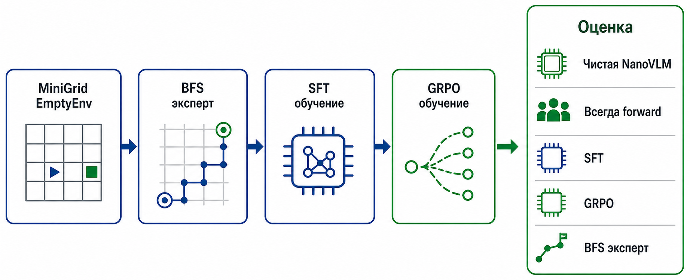
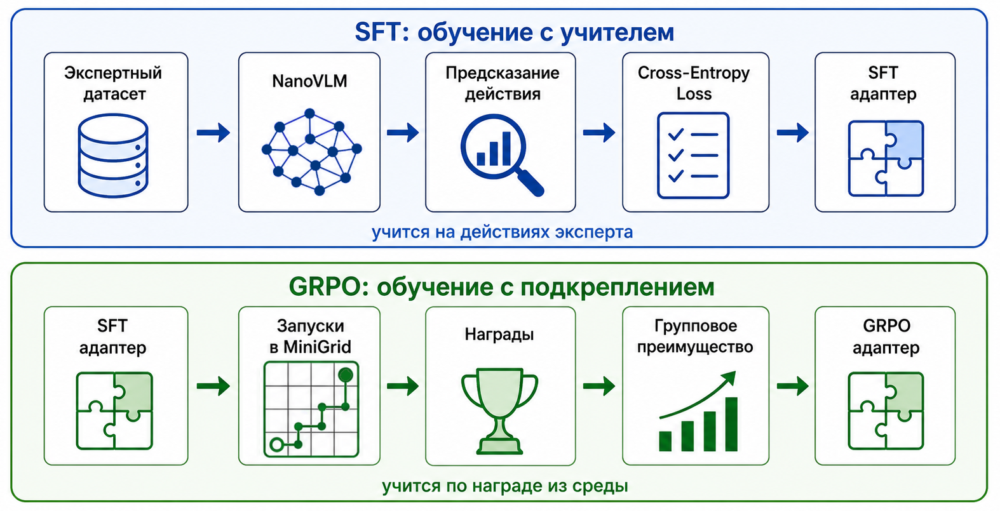

# MiniGrid Navigation NanoVLM (SFT + GRPO)


## Описание проекта

В проекте адаптируется vision-language модель NanoVLM для управления агентом в среде MiniGrid EmptyEnv. Агент получает частичное RGB-наблюдение 7x7 клеток и должен выбрать одно из трёх действий: `left`, `right` или `forward`.

Обучение проводится в два этапа:

1. **SFT (Supervised Fine-Tuning)** на экспертных траекториях, построенных BFS-планировщиком.
2. **GRPO-style RL fine-tuning** для дообучения политики через взаимодействие со средой.

Основные среды:

- `MiniGrid-Empty-8x8-v0` - базовая среда, где текущий pipeline работает хорошо.
- `MiniGrid-Empty-16x16-v0` - более сложная среда с длинными траекториями и большим числом состояний.

Дополнительно проверяются два свойства политики:

- перенос между размерами карты (`8x8 -> 16x16` и `16x16 -> 8x8`);
- устойчивость к изменению цвета цели с зелёного на красный.

Общая схема pipeline:



## Оглавление

1. [Данные и эксперт](#данные-и-эксперт)
2. [Модель и обучение](#модель-и-обучение)
3. [Результаты](#результаты)
4. [Дополнительные эксперименты](#дополнительные-эксперименты)
5. [Запуск проекта](#запуск-проекта)
6. [Структура проекта](#структура-проекта)
7. [Выводы и дальнейшая работа](#выводы-и-дальнейшая-работа)

## Данные и эксперт

Экспертные траектории генерируются с помощью BFS (Breadth-First Search). Внутри BFS состояние включает координаты и направление агента `(x, y, agent_dir)`; `left` и `right` меняют ориентацию, позицию меняет только `forward`.

Для уменьшения искусственного дисбаланса поворотов генератор сравнивает left-first и right-first shortest paths и выбирает путь, который уменьшает накопленный дисбаланс между `left` и `right`.

Каждый пример датасета содержит:

- `ego_image` — частичное RGB-наблюдение агента;
- `global_image` — полный вид среды;
- текстовый промпт;
- экспертное действие (`action`, `action_id`);
- `episode_id`, `step`, `env_size`;
- `agent_pos` — позиция агента `(x, y)` на сетке;
- `agent_dir` — направление агента (`0`–`3`).

SFT и GRPO используют только `ego_image`, `prompt` и `action`; поля `agent_pos` и `agent_dir` нужны для аудита траекторий и анализа датасета.

Датасеты:

| Environment | Path | Episodes | Rows | Action distribution |
|---|---|---:|---:|---|
| 8x8 | `datasets/dataset_8x8` | 1000 | 5280 | `forward=3914`, `left=686`, `right=680` |
| 16x16 | `datasets/dataset_16x16` | 1000 | 10530 | `forward=9105`, `left=726`, `right=699` |

## Модель и обучение

В проекте используется NanoVLM v0.1:

https://github.com/huggingface/nanoVLM/releases/tag/v0.1

Формат входа:

```text
User: <image>
{prompt}
Assistant:
```

Текст промпта:

```text
You are a robot in a 2D grid world. You see a 7x7 partial RGB view in front of you.
Your mission: get to the green goal square as quickly as possible.
Choose the next action: forward, left or right.
```

Целевой ответ:

```text
 left
 right
 forward
```

В SFT prompt tokens маскируются, поэтому loss считается по assistant action, а не по воспроизведению всего промпта. Train/validation split выполняется на уровне эпизодов, чтобы шаги одного эпизода не попадали одновременно в train и validation.

Validation accuracy используется только как вспомогательная offline-метрика. Основная оценка проводится в среде через `success rate`, `average reward`, `timeouts`, `invalid_action_episodes` и среднюю длину успешной траектории.

### Протокол environment evaluation

Политика выбирает действие через `model.generate(..., max_new_tokens=1)`. Сгенерированный token id сопоставляется с action-токенами SFT: ` left`, ` right`, ` forward`.

- Если токен распознан — действие выполняется в MiniGrid.
- Если токен не является одним из трёх action-токенов — эпизод завершается с ошибкой (`invalid_action_episodes`).

Эпизод также может завершиться успехом (достижение цели) или timeout-ом (исчерпан лимит шагов).

После SFT модель дообучается через GRPO-style RL loop. Политика инициализируется из SFT adapter, затем запускаются группы rollout-ов в MiniGrid. Для каждой группы считается group-relative advantage, после чего выполняется clipped update с KL-штрафом к reference SFT policy.

Сравнение этапов SFT и GRPO:



## Результаты

Environment evaluation: `generate`, 250 episodes. Детальные таблицы ниже — **seed 42** (как в README-командах). Для устойчивости SFT / legacy GRPO / generate GRPO также оценивались на **seeds 42, 123, 456** (`scripts/run_tests.py --compare-grpo-protocol`).

### Среда 8x8

На `MiniGrid-Empty-8x8-v0` SFT уже даёт высокое качество, а GRPO дополнительно уменьшает число timeout-ов.

Полный вид среды и частичное наблюдение агента:

| Full view | Agent view |
|---|---|
|  |  |

Команды обучения:

```powershell
python scripts/dataset_generation.py --env-size 8 --save-path datasets/dataset_8x8

python scripts/sft.py --env-size 8 --dataset-path datasets/dataset_8x8 --output-dir checkpoints/sft_adapter_8x8 --epochs 3

python scripts/grpo.py --env-size 8 --dataset-path datasets/dataset_8x8 --sft-adapter-path checkpoints/sft_adapter_8x8/epoch-3 --output-dir checkpoints/grpo_adapter_8x8_generate --lr 5e-6 --epsilon 0.1 --beta 0.1 --lora-dropout 0.0
```

Графики обучения:

| SFT train loss | SFT validation accuracy |
|---|---|
|  |  |

| GRPO loss | GRPO success rate |
|---|---|
|  |  |

SFT 8x8 обучается стабильно: train loss быстро падает почти до нуля, а validation accuracy растёт с `0.35` до `0.83`. GRPO 8x8 имеет высокий success rate почти на всём протяжении обучения; отдельные провалы связаны с тем, что метрика считается на небольших группах rollout-ов и чувствительна к конкретным seed-ам.

Команда тестирования:

```powershell
python scripts/test_models.py --env-size 8 --dataset-path datasets/dataset_8x8 --sft-adapter-path checkpoints/sft_adapter_8x8/epoch-3 --grpo-adapter-path checkpoints/grpo_adapter_8x8_generate/episode-100 --episodes 250
```

Статистика split-а:

- train rows: `4735`, validation rows: `545`;
- majority action: `forward`;
- majority validation accuracy: `0.7413`;
- train action distribution: `left=615`, `right=610`, `forward=3510`;
- validation action distribution: `left=71`, `right=70`, `forward=404`.

Результаты тестирования (seed 42):

| Policy | Success Rate | Avg Reward | Avg Steps (Win) | Timeouts | Invalid actions | Action distribution |
|---|---:|---:|---:|---:|---:|---|
| Majority-forward | 5.2% | 0.052 | 2.2 | 237/250 | 0/250 | L:0.0% / R:0.0% / F:100.0% |
| Base NanoVLM | 0.8% | 0.008 | 1.5 | 0/250 | 248/250 | L:51.0% / R:12.1% / F:36.9% |
| SFT | 95.2% | 0.933 | 5.7 | 10/250 | 2/250 | L:17.1% / R:12.6% / F:70.3% |
| GRPO episode-100 | 98.4% | 0.965 | 5.4 | 3/250 | 1/250 | L:19.5% / R:11.3% / F:69.2% |
| Expert BFS | 100.0% | 0.982 | 5.2 | 0/250 | 0/250 | L:13.4% / R:13.4% / F:73.2% |

Success rate по seed (native 8x8, только SFT / GRPO):

| seed | SFT | legacy GRPO | generate GRPO | generate − legacy |
|---:|---:|---:|---:|---:|
| 42 | 95.2% | 100.0% | 98.4% | −1.6 п.п. |
| 123 | 94.8% | 97.6% | 96.4% | −1.2 п.п. |
| 456 | 94.4% | 94.8% | 96.4% | +1.6 п.п. |
| **mean** | **94.8%** | **97.5%** | **97.1%** | **−0.4 п.п.** |

legacy GRPO: `checkpoints/grpo_adapter_8x8/episode-100` (historical checkpoint). generate GRPO: `checkpoints/grpo_adapter_8x8_generate/episode-100`.

Вывод: чистая NanoVLM без дообучения почти не решает задачу (`0.8%`, `248/250` invalid actions). SFT поднимает success rate до ~`95%` (mean `94.8%`). generate GRPO даёт mean `97.1%` (+2.3 п.п. к SFT); на seed 42 — `98.4%` и меньше timeout-ов (`10/250` → `3/250`). Разница generate vs legacy в среднем небольшая (−0.4 п.п.), сильно зависит от seed.

### Среда 16x16

`MiniGrid-Empty-16x16-v0` сложнее из-за более длинных траекторий. Ошибки действий накапливаются сильнее, поэтому высокая offline accuracy хуже отражает реальное качество политики.

Полный вид среды и частичное наблюдение агента:

| Full view | Agent view |
|---|---|
|  |  |

Команды обучения:

```powershell
python scripts/dataset_generation.py --env-size 16 --save-path datasets/dataset_16x16

python scripts/sft.py --env-size 16 --dataset-path datasets/dataset_16x16 --output-dir checkpoints/sft_adapter_16x16 --epochs 3 --val-split 0.01

python scripts/grpo.py --env-size 16 --dataset-path datasets/dataset_16x16 --sft-adapter-path checkpoints/sft_adapter_16x16/epoch-3 --output-dir checkpoints/grpo_adapter_16x16_generate --max-steps 35 --val-split 0.01
```

Графики обучения:

| SFT train loss | SFT validation accuracy |
|---|---|
|  |  |

| GRPO loss | GRPO success rate |
|---|---|
|  |  |

Для SFT 16x16 validation accuracy растёт с `0.47` до `0.87`, но train loss заметно шумит. GRPO 16x16 также нестабилен: success rate сильно колеблется, а loss имеет резкие пики. Это ожидаемо для более длинной среды с более разреженным reward.

Команда тестирования:

```powershell
python scripts/test_models.py --env-size 16 --dataset-path datasets/dataset_16x16 --sft-adapter-path checkpoints/sft_adapter_16x16/epoch-3 --grpo-adapter-path checkpoints/grpo_adapter_16x16_generate/episode-50 --episodes 250 --max-steps 40 --val-split 0.01
```

Статистика split-а:

- train rows: `10427`, validation rows: `103`;
- majority action: `forward`;
- majority validation accuracy: `0.8641`;
- train action distribution: `left=719`, `right=692`, `forward=9016`;
- validation action distribution: `left=7`, `right=7`, `forward=89`.

Результаты тестирования (seed 42):

| Policy | Success Rate | Avg Reward | Avg Steps (Win) | Timeouts | Invalid actions | Action distribution |
|---|---:|---:|---:|---:|---:|---|
| Majority-forward | 3.2% | 0.032 | 4.1 | 242/250 | 0/250 | L:0.0% / R:0.0% / F:100.0% |
| Base NanoVLM | 0.4% | 0.004 | 1.0 | 0/250 | 249/250 | L:48.9% / R:11.1% / F:40.0% |
| SFT | 83.6% | 0.823 | 18.3 | 34/250 | 7/250 | L:11.7% / R:6.8% / F:81.5% |
| GRPO episode-50 | 83.2% | 0.820 | 16.8 | 38/250 | 4/250 | L:10.2% / R:18.6% / F:71.3% |
| GRPO episode-100 | 72.0% | 0.708 | 19.0 | 60/250 | 10/250 | L:6.3% / R:7.8% / F:85.8% |
| Expert BFS | 100.0% | 0.991 | 10.6 | 0/250 | 0/250 | L:6.8% / R:6.9% / F:86.3% |

Success rate по seed (native 16x16, только SFT / GRPO):

| seed | SFT | legacy GRPO | generate GRPO | generate − legacy |
|---:|---:|---:|---:|---:|
| 42 | 83.6% | 84.8% | 83.2% | −1.6 п.п. |
| 123 | 75.6% | 80.0% | 79.6% | −0.4 п.п. |
| 456 | 81.2% | 82.0% | 85.2% | +3.2 п.п. |
| **mean** | **80.1%** | **82.3%** | **82.7%** | **+0.4 п.п.** |

legacy GRPO: `checkpoints/grpo_adapter_16x16/episode-75`. generate GRPO: `checkpoints/grpo_adapter_16x16_generate/episode-50` (лучший checkpoint по env eval; `episode-100` на seed 42 — `72.0%`).

Вывод: на 16x16 метрики сильно зависят от seed (SFT: `75.6–83.6%`). generate GRPO в среднем чуть выше legacy (`82.7%` vs `82.3%`, +0.4 п.п.) и SFT (+2.6 п.п.); на seed 42 прирост к SFT минимален. Финальный checkpoint не всегда лучший — выбирайте `episode-*` по held-out env eval.

Параметры GRPO нельзя автоматически переносить между размерами среды. Для 8x8 лучше сработала более консервативная конфигурация (`lr=5e-6`, `epsilon=0.1`, `beta=0.1`, `lora_dropout=0.0`), потому что короткая среда уже хорошо решается SFT и слишком сильные RL-обновления ухудшают политику. Для 16x16 эта же консервативная конфигурация оказалась слабее.

## Дополнительные эксперименты

### Перенос между средами

Проверялось, насколько политика, обученная на одном размере среды, переносится на другой. В этих экспериментах `dataset-path` соответствует тестовой среде, а adapter path — среде, на которой модель была обучена.

#### 8x8 -> 16x16

seed 42, 250 episodes.

```powershell
python scripts/test_models.py --env-size 16 --dataset-path datasets/dataset_16x16 --sft-adapter-path checkpoints/sft_adapter_8x8/epoch-3 --grpo-adapter-path checkpoints/grpo_adapter_8x8_generate/episode-100 --episodes 250 --max-steps 40 --val-split 0.01
```

| Policy | Success Rate | Avg Reward | Avg Steps (Win) | Timeouts | Invalid actions | Action distribution |
|---|---:|---:|---:|---:|---:|---|
| Majority-forward | 3.2% | 0.032 | 4.1 | 242/250 | 0/250 | L:0.0% / R:0.0% / F:100.0% |
| SFT trained on 8x8 | 50.8% | 0.503 | 11.1 | 115/250 | 8/250 | L:51.4% / R:15.9% / F:32.6% |
| GRPO trained on 8x8 | 44.0% | 0.436 | 9.7 | 131/250 | 9/250 | L:70.3% / R:15.9% / F:13.8% |
| Expert BFS | 100.0% | 0.991 | 10.6 | 0/250 | 0/250 | L:6.8% / R:6.9% / F:86.3% |

SFT, обученная на 8x8, частично переносится на 16x16 и достигает `50.8%` success rate, что значительно выше majority baseline, но ниже результата SFT, обученной непосредственно на 16x16 (`83.6%`). GRPO, обученная на 8x8, переносится хуже SFT (`44.0%` против `50.8%`) и сильно смещается в сторону поворотов: доля `forward` падает до `12.0%`.

#### 16x16 -> 8x8

seed 42, 250 episodes.

```powershell
python scripts/test_models.py --env-size 8 --dataset-path datasets/dataset_8x8 --sft-adapter-path checkpoints/sft_adapter_16x16/epoch-3 --grpo-adapter-path checkpoints/grpo_adapter_16x16_generate/episode-50 --episodes 250 --max-steps 12 --val-split 0.1
```

| Policy | Success Rate | Avg Reward | Avg Steps (Win) | Timeouts | Invalid actions | Action distribution |
|---|---:|---:|---:|---:|---:|---|
| Majority-forward | 5.2% | 0.052 | 2.2 | 237/250 | 0/250 | L:0.0% / R:0.0% / F:100.0% |
| SFT trained on 16x16 | 88.4% | 0.866 | 5.8 | 21/250 | 8/250 | L:18.9% / R:12.0% / F:69.1% |
| GRPO trained on 16x16 | 92.0% | 0.901 | 5.8 | 13/250 | 7/250 | L:14.3% / R:17.6% / F:68.1% |
| Expert BFS | 100.0% | 0.982 | 5.2 | 0/250 | 0/250 | L:13.4% / R:13.4% / F:73.2% |

Модели, обученные на 16x16, хорошо переносятся на 8x8. SFT достигает `88.4%`, а GRPO (`episode-50`) повышает результат до `92.0%`.

Сводная таблица (native suites; GRPO — generate rollout, mean / seed 42):

| Train env | Test env | SFT success | GRPO success | Вывод |
|---|---:|---:|---:|---|
| 8x8 | 8x8 | 94.8% / 95.2% | 97.1% / 98.4% | среда простая, GRPO даёт стабильный прирост |
| 8x8 | 16x16 | 50.8% | 44.0% | перенос есть, но GRPO ухудшает (seed 42) |
| 16x16 | 16x16 | 80.1% / 83.6% | 82.7% / 83.2% | сложная среда, прирост GRPO небольшой |
| 16x16 | 8x8 | 88.4% | 92.0% | перенос сильный, GRPO помогает (seed 42) |

Transfer и goal-color — только seed 42.

Вывод: перенос асимметричен. Обучение на 16x16 даёт политику, которая хорошо переносится на более короткую 8x8 среду, а GRPO дополнительно улучшает этот перенос. Обратное направление слабее: модели, обученные на 8x8, хуже работают на 16x16, а GRPO-донастройка под короткий горизонт дополнительно ухудшает перенос.

### Изменение цвета цели

seed 42, 250 episodes.

Дополнительно проверялась устойчивость политики к изменению цвета цели: модели, обученные на зелёной цели, тестировались на красной. Это показывает, выучила ли модель обобщённое поведение навигации к цели или опирается на конкретный цветовой паттерн.

Два параметра задаются независимо:

- `--goal-color` - фактический цвет цели в MiniGrid;
- `--prompt-goal-color` - цвет цели, указанный в промпте модели.

```powershell
python scripts/test_models.py --env-size 8 --dataset-path datasets/dataset_8x8 --sft-adapter-path checkpoints/sft_adapter_8x8/epoch-3 --grpo-adapter-path checkpoints/grpo_adapter_8x8_generate/episode-100 --episodes 250 --goal-color red --prompt-goal-color red

python scripts/test_models.py --env-size 8 --dataset-path datasets/dataset_8x8 --sft-adapter-path checkpoints/sft_adapter_8x8/epoch-3 --grpo-adapter-path checkpoints/grpo_adapter_8x8_generate/episode-100 --episodes 250 --goal-color red --prompt-goal-color green
```

| Visual goal color | Prompt color | Policy | Success Rate | Avg Reward | Avg Steps (Win) | Timeouts | Invalid actions | Action distribution |
|---|---|---|---:|---:|---:|---:|---:|---|
| green | green | SFT | 95.2% | 0.933 | 5.7 | 10/250 | 2/250 | L:17.1% / R:12.6% / F:70.3% |
| green | green | GRPO | 98.4% | 0.965 | 5.4 | 3/250 | 1/250 | L:19.5% / R:11.3% / F:69.2% |
| red | red | SFT | 40.4% | 0.393 | 7.4 | 140/250 | 9/250 | L:35.8% / R:24.7% / F:39.5% |
| red | red | GRPO | 6.0% | 0.059 | 6.5 | 220/250 | 15/250 | L:52.9% / R:32.3% / F:14.8% |
| red | green | SFT | 44.0% | 0.428 | 7.5 | 135/250 | 5/250 | L:33.7% / R:24.3% / F:42.0% |
| red | green | GRPO | 8.8% | 0.086 | 7.4 | 211/250 | 17/250 | L:50.2% / R:33.8% / F:16.0% |

Вывод: SFT частично переносит навигацию на красную цель, но качество всё равно падает с `95.2%` до `40.4–44.0%`. GRPO, наоборот, резко теряет устойчивость: несмотря на `98.4%` в green/green, на красной цели результат падает до `6.0–8.8%`, а доля поворотов растёт. Модель в значительной степени выучила визуальный паттерн зелёной клетки, а не абстрактное понятие цели.

## Запуск проекта

### Установка

1. Клонируйте репозиторий.
2. Установите зависимости:

```powershell
pip install -r requirements.txt
```

3. Скачайте [NanoVLM](https://github.com/huggingface/nanoVLM/releases/tag/v0.1) и поместите папку в корень проекта под именем `nanoVLM`.

### Evaluation

Одиночный прогон (seed 42, как в таблицах выше):

```powershell
python scripts/test_models.py --env-size 8 --dataset-path datasets/dataset_8x8 --sft-adapter-path checkpoints/sft_adapter_8x8/epoch-3 --grpo-adapter-path checkpoints/grpo_adapter_8x8_generate/episode-100 --episodes 250
```

```powershell
python scripts/test_models.py --env-size 16 --dataset-path datasets/dataset_16x16 --sft-adapter-path checkpoints/sft_adapter_16x16/epoch-3 --grpo-adapter-path checkpoints/grpo_adapter_16x16_generate/episode-50 --episodes 250 --max-steps 40 --val-split 0.01
```

Мульти-seed сравнение SFT / legacy GRPO / generate GRPO:

```powershell
python scripts/run_tests.py --pipeline all --compare-grpo-protocol --seeds 42,123,456
```

Если `wandb` недоступен или не нужен, используйте флаг:

```powershell
--no-wandb
```

## Структура проекта

```text
vlm-minigrid-rl/
├── checkpoints/
│   ├── sft_adapter_8x8/          # SFT LoRA adapter для 8x8
│   ├── grpo_adapter_8x8/         # historical GRPO LoRA (pre-generate protocol)
│   ├── grpo_adapter_8x8_generate/ # GRPO LoRA (generate rollout, README 8x8)
│   ├── sft_adapter_16x16/        # SFT LoRA adapter для 16x16
│   ├── grpo_adapter_16x16/       # historical GRPO LoRA (pre-generate protocol)
│   └── grpo_adapter_16x16_generate/ # GRPO LoRA (generate rollout, README 16x16)
├── datasets/
│   ├── dataset_8x8/              # экспертный датасет для 8x8
│   └── dataset_16x16/            # экспертный датасет для 16x16
├── docs/
│   ├── figures/                  # графики обучения и примеры изображений среды
├── nanoVLM/                      # репозиторий NanoVLM
├── notebooks/                    # exploratory notebooks
├── scripts/
│   ├── _bootstrap.py             # настройка import paths для scripts/
│   ├── dataset_generation.py     # генерация экспертных траекторий
│   ├── sft.py                    # supervised fine-tuning
│   ├── grpo.py                   # RL fine-tuning
│   ├── run_tests.py              # orchestration eval suites + multi-seed compare
│   └── test_models.py            # тестирование и оценка моделей
├── src/
│   └── vlm_minigrid_rl/
│       ├── minigrid_utils.py     # MiniGrid reset, BFS expert, environment metrics
│       ├── model_utils.py        # NanoVLM loading, preprocessing, inference, scoring
│       ├── paths.py              # project paths и NanoVLM path setup
│       └── training_utils.py     # seed, split, baselines, action parsing
├── README.md
└── requirements.txt
```

## Выводы и дальнейшая работа

В текущем состоянии проекта удалось:

- сгенерировать экспертные BFS trajectories;
- обучить SFT baseline для прямого выбора действий;
- реализовать GRPO fine-tuning;
- добавить Base NanoVLM, majority-forward и expert BFS baselines;
- получить `95.2%` success rate для SFT и `98.4%` для GRPO (`generate` rollout) на 8x8 (seed 42; mean по 3 seed: `94.8%` / `97.1%`);
- показать, что 16x16 существенно сложнее: SFT mean `80.1%` (seed 42: `83.6%`), generate GRPO mean `82.7%` (seed 42: `83.2%`);
- показать асимметричный перенос между 8x8 и 16x16;
- показать слабую устойчивость к изменению цвета цели.

Дальнейшие направления исследования:

- **Более надёжная evaluation** — headline-числа дополнены multi-seed таблицами (42/123/456); для transfer/goal-color нужны те же прогоны.
- **Поэтапное обучение и обучение на смешанных средах разного размера** - обучать модель последовательно на средах разного размера или на объединённом датасете для улучшения устойчивости.
- **Prompt engineering** - сравнение разных промптов.
- **Формат `text+action` и Chain-of-Thought** - генерация краткого описания видимой среды или плана перед выбором итогового действия.
- **VLA-подход (Vision-Language-Action)** - добавление отдельной головы выбора действия вместо генерации действия как текстового токена.
